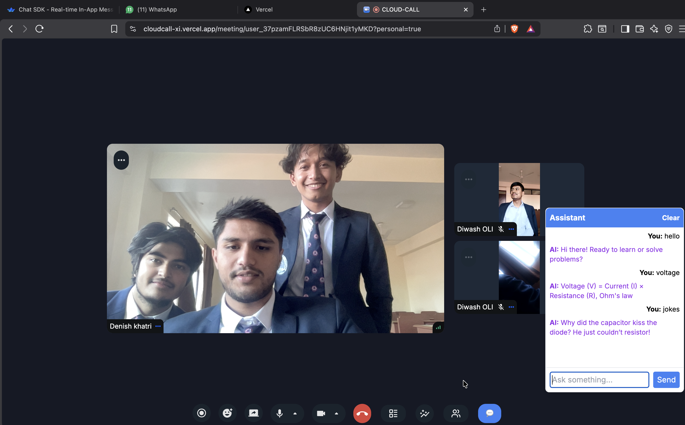

# ☁️ CloudCall - Video Conferencing App

A web-based video conferencing platform inspired by Zoom and Microsoft Teams.

---

## 📸 Demo



---

## ⚙️ Features

- Video & audio meetings
- Screen sharing
- Chat system
- Meeting rooms
- User authentication

---

## 🛠️ Tech Stack

- Next.js
- WebRTC
- Node.js
- Socket.io

---

## 🚀 Getting Started

```bash
npm install
npm run dev
